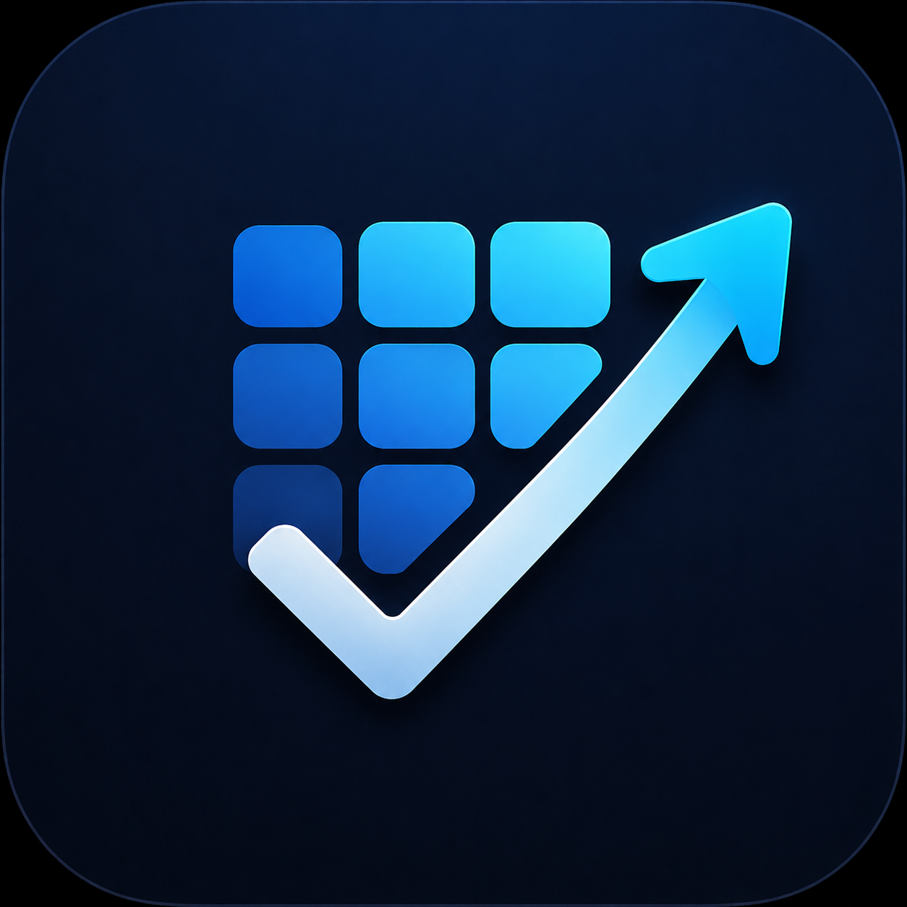

# 📱 Mobile Applications Registry & Portfolio CDN

[](app.json)
[](app.json)
[](https://github.com/kachakaran6)
[](https://kachakaran.me)

Centralized mobile application catalog and static asset repository maintained by **[Karan Kacha](https://kachakaran.me)**. This repository serves as the single source of truth (SSOT) and remote config endpoint for in-app "Our Apps" showcases, portfolio sites, and app discovery services across the ecosystem.

---

## 🌐 Endpoints

| Resource | URL |
| :--- | :--- |
| **Direct Raw JSON** | `https://raw.githubusercontent.com/kachakaran6/Application-json/main/app.json` |
| **Asset Base CDN** | `https://raw.githubusercontent.com/kachakaran6/Application-json/main/images/` |

---

## 📦 Application Showcase

| App | Name & Package | Status | Description | Play Store |
| :---: | :--- | :---: | :--- | :---: |
|  | **Vault X**<br>`com.vaultx.vault_x` |  | The ultimate link vault. Save, organize, and secure your digital bookmarks effortlessly. | [View App](https://play.google.com/store/apps/details?id=com.vaultx.vault_x) |
|  | **Trust Tracker**<br>`com.trusttracker.trust_tracker_flutter` |  | A secure personal finance app to effortlessly track your subscriptions and manage daily expenses. | [View App](https://play.google.com/store/apps/details?id=com.trusttracker.trust_tracker_flutter) |
|  | **SnapDocs**<br>`com.snapdocs.app` |  | Offline secure document storage application. | [View App](https://play.google.com/store/apps/details?id=com.snapdocs.app) |
|  | **Noctune**<br>`com.noctune.music` |  | Modern music player for music lovers who want to listen offline. | [View App](https://play.google.com/store/apps/details?id=com.noctune.music) |
|  | **Divine Geeta**<br>`com.divinegeeta.app` |  | Daily spiritual wisdom and insights for a peaceful life. | [Details](https://play.google.com/store/apps/details?id=com.divinegeeta.app) |
|  | **GymBuddy**<br>`com.gymbuddy.application` |  | Monitor workouts, body measurements, fitness progress, and achieve your health goals. | [Details](https://play.google.com/store/apps/details?id=com.gymbuddy.application) |
|  | **TaskMitra**<br>`com.taskmitra.application` |  | Organize tasks, manage projects, set reminders, and boost productivity with ease. | [Details](https://play.google.com/store/apps/details?id=com.taskmitra.application) |
|  | **Habitly**<br>`app.habitly` |  | A minimal habit tracker that helps you build lasting habits and unstoppable streaks. | [Details](https://play.google.com/store/apps/details?id=app.habitly) |

---

## 🗂 Data Schema (`app.json`)

Each entry inside the `apps` array conforms to the following schema:

```json
{
  "id": "app.habitly",
  "appName": "Habitly - Habit Tracker",
  "packageName": "app.habitly",
  "playStoreUrl": "https://play.google.com/store/apps/details?id=app.habitly",
  "iconUrl": "/images/habitly.png",
  "status": "coming_soon",
  "description": "A minimal habit tracker that helps you build lasting habits and unstoppable streaks."
}
```

### Field Definitions

| Field | Type | Required | Description |
| :--- | :---: | :---: | :--- |
| `id` | `string` | Yes | Unique identifier for the application (typically matches `packageName`). |
| `appName` | `string` | Yes | Display name with optional tagline (e.g. `Habitly - Habit Tracker`). |
| `packageName` | `string` | Yes | Android Application ID / Bundle Identifier. |
| `playStoreUrl` | `string` | Yes | Canonical Google Play Store listing URL. |
| `iconUrl` | `string` | Yes | Relative or absolute path to the app icon image asset (e.g., `/images/habitly.png`). |
| `status` | `string` | Yes | Release lifecycle: `"production"` (live on store) or `"coming_soon"` (in development / review). |
| `description` | `string` | Yes | Concise description highlighting key features and value proposition. |

---

## 🚀 Client Integration Examples

### Flutter / Dart

```dart
import 'dart:convert';
import 'package:http/http.dart' as http;

Future<List<Map<String, dynamic>>> fetchAppsCatalog() async {
  const url = 'https://raw.githubusercontent.com/kachakaran6/Application-json/main/app.json';
  final response = await http.get(Uri.parse(url));

  if (response.statusCode == 200) {
    final Map<String, dynamic> data = jsonDecode(response.body);
    return List<Map<String, dynamic>>.from(data['apps']);
  }
  throw Exception('Failed to load apps catalog');
}
```

### JavaScript / TypeScript

```typescript
interface AppItem {
  id: string;
  appName: string;
  packageName: string;
  playStoreUrl: string;
  iconUrl: string;
  status: 'production' | 'coming_soon';
  description: string;
}

async function getApps(): Promise<AppItem[]> {
  const res = await fetch(
    'https://raw.githubusercontent.com/kachakaran6/Application-json/main/app.json'
  );
  const data = await res.json();
  return data.apps;
}
```

---

## ➕ Adding a New Application

1. **Add Icon Asset**:
   - Place a square PNG (`512x512` to `1254x1254`) inside the `images/` directory using lowercase kebab-case naming:
     ```
     images/<app-name>.png
     ```
2. **Update [app.json](app.json)**:
   - Add a new object entry to the `"apps"` array adhering to the schema above.
3. **Commit & Push**:
   - Once pushed to `main`, raw endpoints will serve the updated catalog immediately.

---

## 👨‍💻 Maintainer

**Karan Kacha**
- Portfolio: [kachakaran.me](https://kachakaran.me)
- GitHub: [@kachakaran6](https://github.com/kachakaran6)
